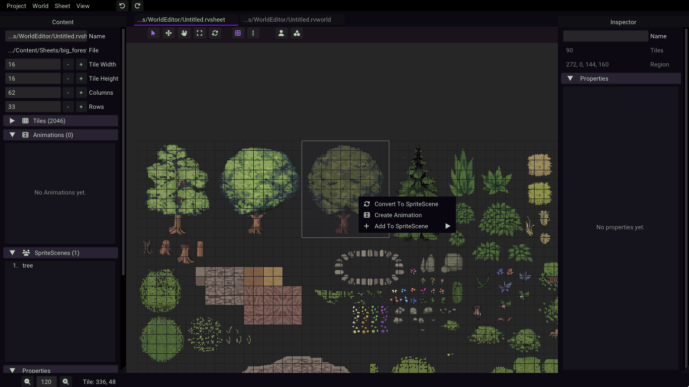
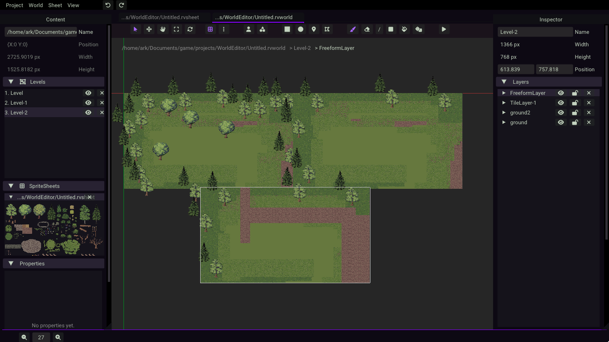

# About Wored 
Shorthand for World Editor :) 

Wored is a 2D level and sprite sheet editor for topdown games.

It currently is only applicable for Monogame.

## Development 
This project is under development. 

### Features
- Spritesheet editor 
- Level editor
- Custom properties (assignable key-value) per levels, tiles, sprites, scenes and animations 
- Basic shapes (rectangle, ellipse, polygon) which you can embed directly as properties for Scenes, Tiles and Levels, useful for designating areas or collisions


### Spritesheet Editor
A way of creating sprite sheets from a big image, separating, labeling, tiles and sprites
- Scenes, composed of group of tile, grouping multiple freely transformed sprites
- Keyframe animation for Scenes
- By-frame animation for Tiles

### Level Editor
- Orthographic tile map layer
- Transform-free scene map layer
- Position levels freely1


## Compiling
This project uses purely with C# using Monogame framework together with a third-party library (Nez). And built using .NET 8.
1. Clone the project
	```
	git clone https://github.com/Matsukari/game-world-editor.git
	```

2. For linux 
	Execute the script. Make sure to mark the file as executable first. 
	```
	./monoaction run
	```

2. For others
	From the project's root directory:
	```
	dotnet run --project Source/WorldEditor.Desktop
	```


